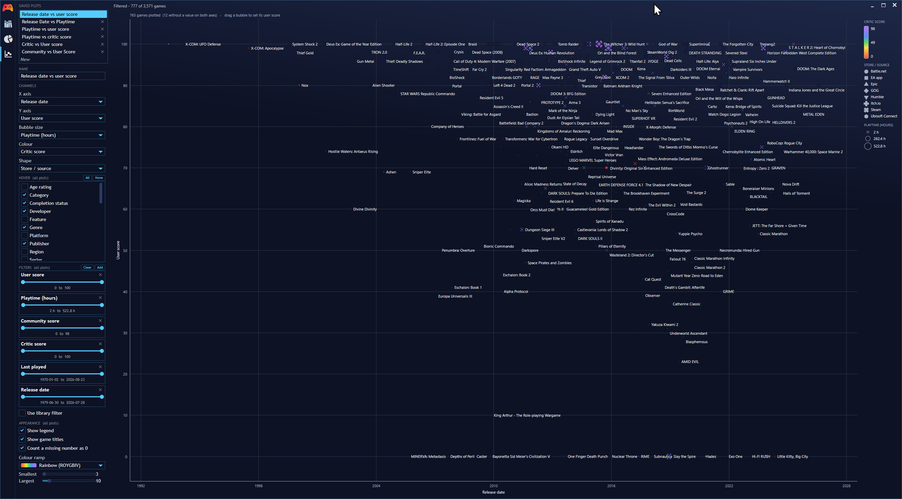
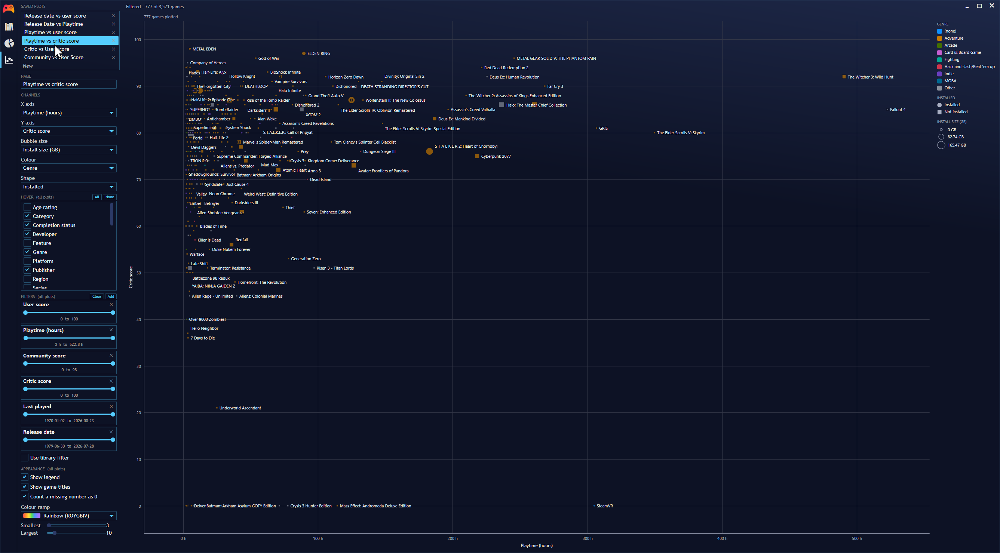
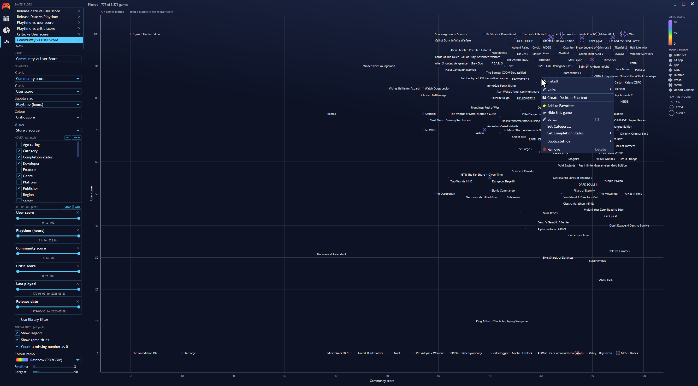

# Charts for Playnite

A `Charts` sidebar tab for [Playnite](https://playnite.link): configurable bubble
plots over your own game library.

Any column of the game table can drive any channel — X, Y, bubble size, colour,
shape and the hover card — and each combination can be saved, renamed and
re-opened. Filters, hover columns and appearance are shared by every saved plot,
so you can filter once and then flick between views to explore.



- Bubble **area** carries the size value, not its radius.
- Categorical colour uses a validated all-pairs palette (every pair separable
  under colour-vision deficiency, on both the light and dark Playnite surfaces);
  numeric colour uses a pickable ramp, graded the same way size is.
- Shape encodes a second category, and a legend is always drawn.
- Right-click a bubble for Playnite's own game menu — borrowed at runtime, not
  reimplemented, so it stays in step with Playnite.
- Drag a bubble along a user-score axis to set that game's score.

Colour and shape take categories as happily as numbers — here genre, and whether the
game is installed, over playtime against critic score:



Right-click a bubble and you get Playnite's own game menu, other extensions included:



## Install

From Playnite: **Add-ons → Browse → Generic**, search for *Charts*.

Or by hand: download the `.pext` from
[Releases](https://github.com/benedictcarter/playnite-charts/releases) and open it
with Playnite, or copy `PlayniteCharts.dll`, `extension.yaml` and `icon.png` into
`%AppData%\Playnite\Extensions\PlayniteCharts` and restart Playnite.

## Build

.NET Framework 4.6.2, WPF, old-style `.csproj` with `packages.config`. The only
compile-time dependency is the Playnite SDK (NuGet).

```sh
./.tools/nuget.exe restore packages.config -PackagesDirectory packages
"/c/Program Files (x86)/Microsoft Visual Studio/18/BuildTools/MSBuild/Current/Bin/MSBuild.exe" \
  PlayniteCharts.csproj -p:Configuration=Debug
```

Or `dev/deploy-extension.sh`, which restores, builds, closes a running Playnite,
copies the files in and restarts it.

## Looking at the chart without Playnite

`DevHarness` fakes the game database and renders the chart offscreen to PNGs —
every ramp on both surfaces, hover and drag states, and the settings panel:

```sh
dev/render.sh <out-dir>
```

Colour is the one thing that cannot be reviewed by reading hex values, so the
harness exists to be looked at. See [LESSONS_LEARNT.md](LESSONS_LEARNT.md).
